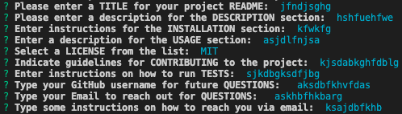

# READMEGen

## Description

This repository is for building a CLI interface that ease the creation of README files. The objective is to present a simple and user friendly interface where anyone can build up the most common components on a README file to upload into Github for any kind of software development project.

## Table of Contents

1. [Description](#description)
2. [Installation](#installation)
3. [Usage](#usage)
4. [Contributing](#contributing)
6. [Test](#test)
7. [Questions](#questions)
8. [License](#license)

## Installation

In order to initialize we have to open a dedicate terminal in the same path as where the index.js is stored. Inside the terminal input `node index.js` in order to run the script just after installing the required dependencies (fs, inquirer).

## Usage

Answer all the questions that youll be prompted with afte running the `node index.js` command.
Follow this tutorial to know how to use this tool properly: [tutorial video link]().
The end README.md file will be stored inside the utils directory.

## License

Copyright (c) [Luisrszm](https://github.com/Luisrszm). All rights reserved.

Licensed under the [MIT](https://choosealicense.com/licenses/mit/) license.

## Contributing

There are many ways in which you can participate in this project, for example:

- Submit bugs and feature requests, and help us verify as they are checked in
- Review source code changes
- Review the documentation and make pull requests for anything from typos to additional and new content

---

## Tests
Example of sample questions and random input to ilustrate what should be expected:

The end README.md file will be store inside the utils directory.

## Questions

If you are interested in fixing issues and contributing directly to the code base or have questions, please contact at:
- Email: rzmz1639@gmail.com
- GitHub: [Luisrszm](https://github.com/Luisrszm)

## Badges

